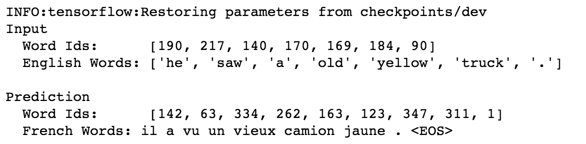
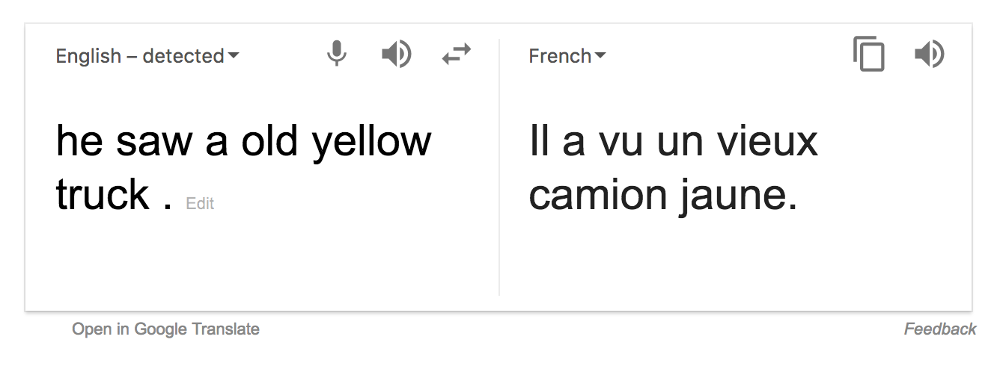

# language-translation-with-seq2seq
language translation with sequence to sequence 

# Dependencies
1. Tensorflow 1.1
2. Python 3.5

# Run
Open [Jupyter Notebook File dlnd_language_translation.ipynb](dlnd_language_translation.ipynb)

For people who likes to debug code in your IDE, all code included in [train.py](train.py), simply run this file 
will train your network

GPU needed

# Result
```
8 Epoches: 
    Train Accuracy: 0.9621, Validation Accuracy: 0.9584, Loss: 0.0396
```
## Our Version


## Google Translate Version
